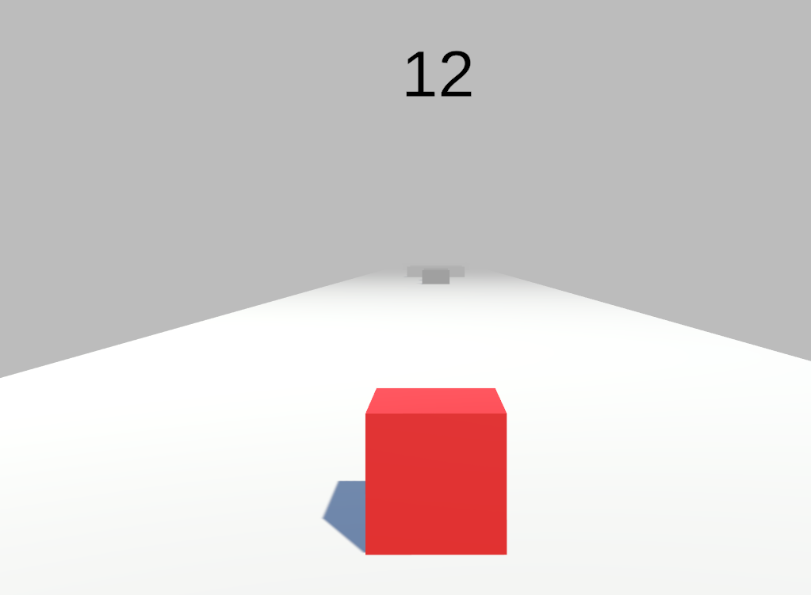

# Cube Game

## Description
In this game you are a cube with the objective of reaching the end of the level without hitting obstacles or falling off the edge.
If the player hits an obstacle or falls off the platform, the level will reset. If they make it to the end, the next level will load.
There are a total of three levels.

I decided to make this game because I enjoy Video Games and wanted to make one of my own. Through research I found that the Unity Game Engine is a 
great tool for beginners who want to get hands on experience with game development, so I looked up some tutorials (shoutout to Brackeys!) and made this.

I hope you like it!

## Requirements
Windows OS

## How to install and run Cube Game

go into the Cube Game repo and download the zip.
run the executable in CubeGame > CubeGame.exe

## Controls

Press the 'A' key to move left.
Press the 'D' key to move right

To quit the game there is a button "Quit" in the start menu as well when you beat the game.

## Tools Used
Unity Engine
C# Programming Language

